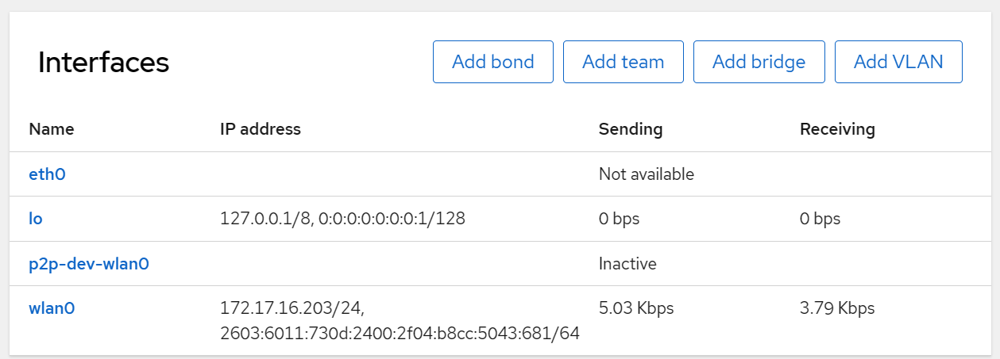

# Network Configuration
The Networking system tool in the web console permits viewing the status
of the network as well as making network configuration changes to the appliance.

# Observing Network Status and Configuration
1. Log in to the web console with administrator privileges.
   For details, see [Cockpit Basics](cockpit-basics.md).

2. Click **Networking** in the web console menu on the left.

3. At the top of the screen will be the network data statistics
for transmitted and receiving network traffic. This information
can be helpful if there are questions about network bandwidth
utilization:

4. The next panel down shows the current configuration of the 
present network adapters:

5. Finally, at the bottom is the logs about the current
state of the network:

# Changing Adapter Setting
1. 1. Log in to the web console with administrator privileges.
   For details, see [Cockpit Basics](cockpit-basics.md).

2. Click **Networking** in the web console menu on the left.

3. Scroll down to the **Interfaces** section

4. Click on the **Name** of the interface

5. Make desired changes

6. Changes take place immediately. Be cautious when changing
IP addressing because you may accidentally remove your ability
to access to the console.

___
Note: Some content copied from 
[__Managing systems using the RHEL9 web console__](https://access.redhat.com/documentation/en-us/red_hat_enterprise_linux/9/html/managing_systems_using_the_rhel_9_web_console/index)
which is released under the Creative Commons Attribution–Share Alike 3.0
Unported license ("CC-BY-SA")
