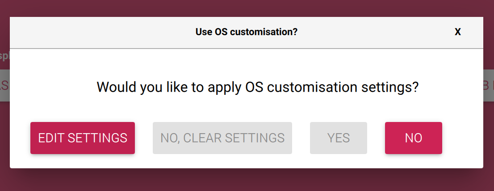
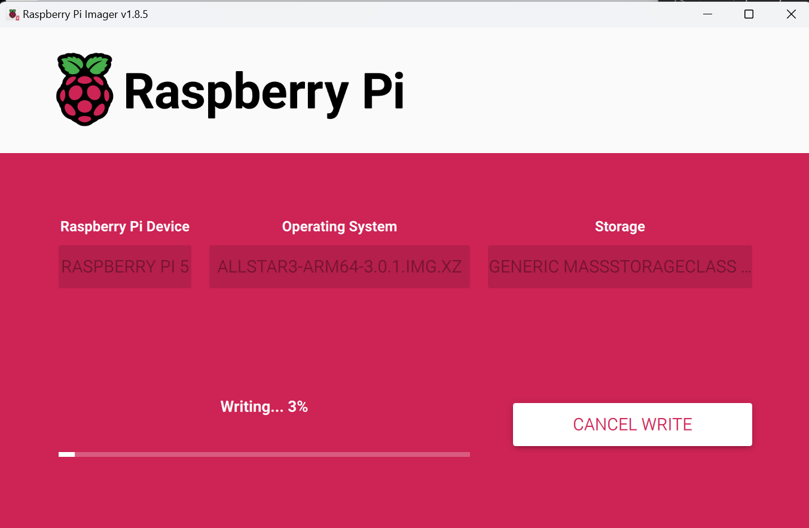
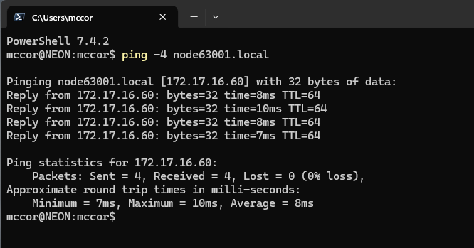
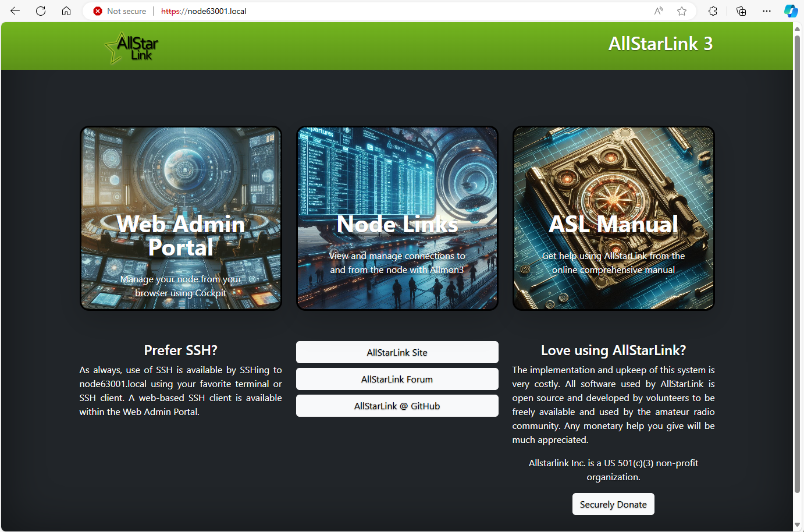
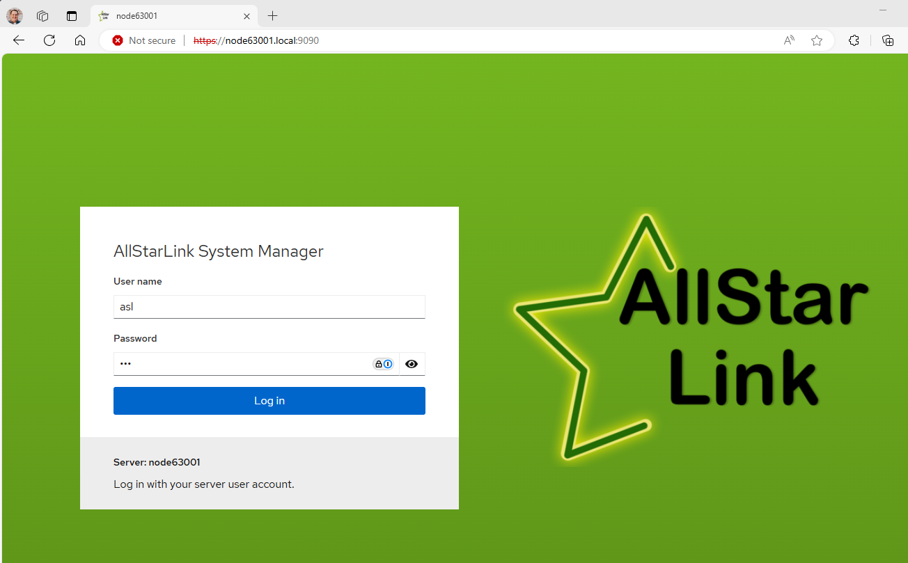
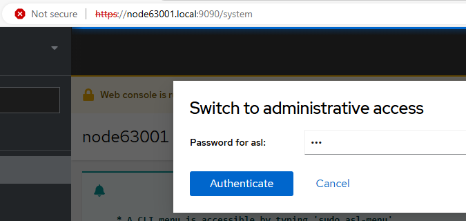
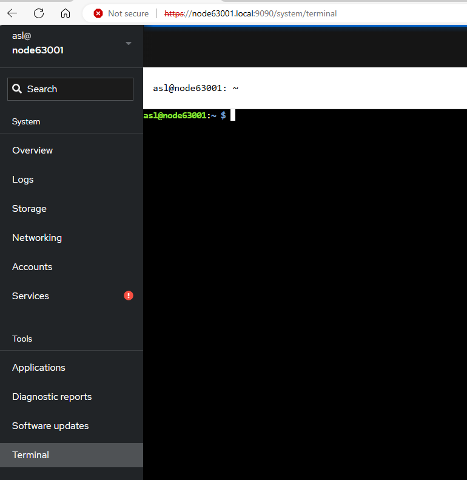
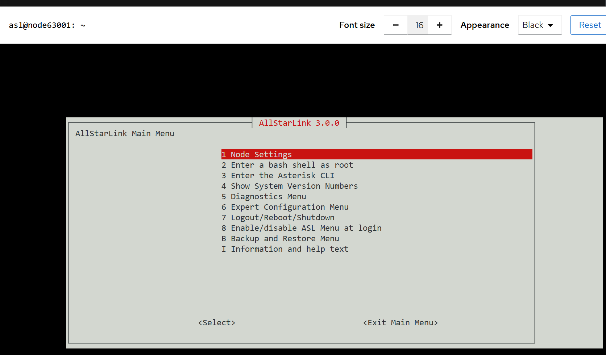

# Raspberry Pi Install

 The Raspberry Pi image includes
the following to make a complete AllStarLink system:

* Asterisk 20 LTS + app_rpt
* asl-* commands
* ASL3 Menu (asl-menu)
* Allmon3
* Web-based administration
* A nice landing page

**You must use the Raspberry Pi Imager** even if you prefer another imager and carefully follow the instructions below.
Failure to do so will result in a system that won't boot or that you will not be able to login to.

You will install an image on a microSD card and go. This is the simplest install. For
most nodes, the menus will walk you through the setup. **Note: a minimum SD card size
of 4G is required and it is recommended to use at least an 8G SD card.**

## Pi Appliance Requirements
The following are the system requirements for the Pi Appliance

| | Required | Recommended
|------|-----------|-------------|
| **Hardware** | Arm v8 64-bit CPU   Raspberry Pi 2, 3, 4, 5, Zero 2 W, 400 | Raspberry Pi 4B or 5B |
| **Memory** | Minimum 512M | 4G |
| **Storage** | Minimum 4G or larger | 8GB Class 10 |s

The ASL3 Appliance been tested on Raspberry Pi 3, 4, 5, and Zero 2W.

## Step-by-Step Pi Appliance Setup

These directions are specific for Windows by example , but in general,
should work the same for the same tool set on MacOS and Linux. For each screenshot
below, click on the image for a larger version.

Note: For this example and all documentation, the hostname used shall be
`node63001` and the node number is `63001`. Replace "63001" with your
node number as you proceed through these directions.

1. If you do not already have it installed, install the
[Raspberry Pi Imager](https://www.raspberrypi.com/software/).

2. Download the [latest release image](https://repo.allstarlink.org/images/pi/). This will
be named `allstar3-arm64-X.Y.Z.img.xz` where "X.Y.Z" is the version. The version will
be something like 3.0.1. Save it to your local `Downloads` directory.

3. Launch **Raspberry Pi Imager** from the start menu.

    {width="400"}

4. Click on **CHOOSE DEVICE** and choose the type of
Pi hardware on which AllStarLink 3 Appliance is being installed.

    {width="400"}

5. Click on **CHOOSE OS**. Scroll to the bottom of the
list that appears and select **Use custom**.

    {width="400"}

6. A **Select image** dialog box will appear. Navigate to the
`Downloads` folder and select the image downloaded in step 2.
It will be named something like allstar3-arm64-3.0.1.img.xz.
Then click **Open**.

    {width="400"}

7. Connect the SD card or the SD card in a USB adapter to
the computer. Then click on **CHOOSE STORAGE**. An option
will be presented named something such as "Mass Storage Device USB
Device - 16.0 GB". Click on that entry.

    {width="400"}

8. Click **NEXT**

9. A box labelled "Use OS customisation?" will appear. Click on
**EDIT SETTINGS**

    {width="400"}

10. Check the box next to **Set hostname** and enter a hostname
for the device to appear as on the network. In this example,
`node63001` is used. Unless you have another naming convention
for AllStarLink nodes, use the nodeNNNNN format.

11. Check the box next to **Set username and password**
and enter a username and password. It is recommended to set the
username to 'asl' if you have no strong feeling about the
username. Choose a good password and record the password somewhere
safe. **NOTE: There is NO DEFAULT USER for the image. Failure to
set an account will require a reimage of the SD card with the
proper settings.**

12. If the device will be connected to WiFi, check the
box "Configure wireless LAN" and then enter
the name of the wireless network in **SSID** and the password for
that network in **Password**. Change the "Wireless LAN country" to **US**
or another country as appropriate. Setting this is not necessary
if the Pi will use a network cable rather than wireless.

13. Check the box next to **Set locale settings** and change the "Time zone"
to the desired region. The timezone settings will control any time-based
announcements and schedule jobs. After completing steps 10-13, the customization
should look something like:
    {width="400"}

14. Click **SAVE** in "OS Customisation".

15. Click **YES** for "Use OS customisation?"

16. Click **YES** to continue to write the image to the SD card.

    {width="400"}

17. Depending on the speed of the computer and the type of SD card
one will have time for a beverage of their choice. When the write is complete,
eject the card, remove the card from computer and insert it into the Pi.
If using a USB adapter for the SD card, remove the SD card from the adapter
and insert the card into the Pi. The Pi __will not__ use the SD card in the
USB adapter.

18. Power on the Pi. Wait approximately 2 to 5 minutes for the Pi to boot
and perform the various first boot tasks. Depending on the type of a Pi
board used, this process could be lengthy. If there is a screen connected
to the Pi, it will be noted that Pi will reboot several times.
This is normal and expected.

19. (Optional) Network connectivity may be tested using the command
to ping the hostname set in step 10. For example, if the hostname
set was "node63001" then do `ping -4 node63001.local` from a
command prompt or PowerShell window. When you get a response,
the host is connected to the network.

    {width="400"}

20. Open a web browser and navigate to `https://nodeNNNNN.local`. In this
example the name was `node63001` then one would enter
`https://node63001.local`. Depending on your network and
browser, one may have to enter the name several times until the
page displayed. The first connection will report a message that
"Your connection isn't private". For the Pi appliance, this is
acceptable. Click on **Advanced** and then
**Continue to node63001.local (unsafe)**. This only must be done
the first time.

    {width="400"}

21. The AllStarLink Launchpad will appear. Clicking on
**Web Admin Portal** will take one to the web-based administration
portal that includes a web-based SSH client for using asl-menu
and other commands. Clicking on **Node Links** will take one
to the Allmon3 interface. Clicking on **ASL Manual** will take one
to the top of this manual.

    

22. To setup the new node, click on **Web Admin Portal**. Similar
to step 20, click **Advanced** and **Continue to node63001.local (unsafe)**
to see the logon box.This only must be done the first time. Enter
the username and password configured during the imaging process
above. Click **Log in**

    

23. The Overview tab is displayed. Using the Web Admin Portal (Cockpit)
 with AllStarLink is [covered in the manual](../pi/index.md). At the top,
 click on **Turn on administrative access*

    

    Enter the password again when prompted and click **Authenticate**

    

24. The web-based SSH console appears as **Terminal** at the bottom
of the left scrollable menu. Click it and SSH console will appear:

    

The Terminal window is a complete interface to AllStarLink,
Asterisk, and more. No SSH client is required although use
of SSH directly is fully supported.

## Quick Config via ASL-Menu
The node may now be configured. New users or those wanting a
quick start experience should [use the asl-menu utility](menu.md)
with `sudo asl-menu`.

The menu will appear:

## Asterisk Console
To start the asterisk console from the Terminal window
enter `sudo asterisk -rv`.

## Software Updates
One should also apply any latest updates and reboot the device
as described in [Cockpit Updates](../pi/cockpit-updates.md).

## Logging Out
When finished with the admin system, click on **Session**
in the upper right and then choose **Logout**.
