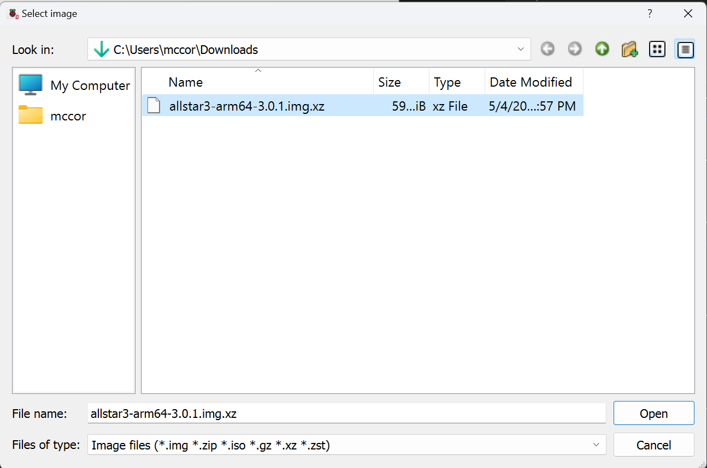

# Step-by-Step Pi Appliance Setup
These directions are specific for Windows by example , but in general,
should work the same for the same tool set on MacOS and Linux.

1. If you do not already have it installed, install the
[Raspberry Pi Imager](https://www.raspberrypi.com/software/).

2. Download the [latest release image](https://repo.allstarlink.org/images/pi/). This will
be named `aslstar3-arm64-X.Y.Z.img.xz` where "X.Y.Z" is the version. The version will
be something like 3.0.1. Save it to the local `Downloads` directory.

3. Launch **Raspberry Pi Imager** from the start menu.

4. Click on **CHOOSE DEVICE** and choose the type of
Pi hardware on which Firefly Logger is being installed.

5. Click on **CHOOSE OS**. Scroll to the bottom of the
list that appears and select **Use custom**. 

6. A **Select image** dialog box will appear. Navigate to the
`Downloads` folder and select the image downloaded in step 2.
It will be named something like allstar3-arm64-3.0.1.img.xz.
Then click **Open**.

7. Connect the SD card or the SD card in a USB adapter to
the computer. Then click on **CHOOSE STORAGE**. An option
will be presented named something such as "Mass Storage Device USB
Device - 16.0 GB". Click on that entry.

8. Click **NEXT**

9. A box labelled "Use OS customisation?" will appear. Click on
**EDIT SETTINGS**

10. Check the box next to **Set hostname** and enter a hostname
for the device to appear as on the network. It is recommended
to choose a functional name such as "asl3-node50185" (using your
node number) or "CALLSIGN-hotspot" (e.g. "w1aw-hotspot").

11. Check the box next to **Set username and password**
and enter a username and password. It is recommended to set the
username to 'asl' if you have no strong feeling about the
username. Choose a good password and record the password somewhere
safe. **NOTE: There is NO DEFAULT USER for the image. Failure to
set an account will require a reimage of the SD card with the
proper settings.**

12. If the device will be connected to WiFi, check the
box "Configure wireless LAN" and then enter
the name of the wireless network in **SSID** and the password for
that network in **Password**. Change the "Wireless LAN country" to **US**
or another country as appropriate. Setting this is not necessary 
if the Pi will use a network cable rather than wireless.

13. Check the box next to **Set locale settings** and change the "Time zone"
to the desired region. The timezone settings will control any time-based
announcements and schedule jobs. After completing steps 10-13, the customization
should look something like:

14. Click **SAVE** in "OS Customsation".

15. Click **YES** for "Use OS customisation?"

16. Click **YES** to continue to write the image to the SD card.

17. Depending on the speed of the computer and the type of SD card
one will have time for a beverage of their choice. When the write is complete,
remove the card from computer and insert it into the Pi. If using a USB adapter
for the SD card, remove the SD card from the adapter and insert the card into
the Pi. The Pi __will not__ use the SD card in the USB adapter.

18. Power on the Pi. Wait approximately 2 minutes for the Pi to boot
and perform the various firstboot tasks.

19. (Optional) Network connectivity may be tested using the command
to ping the hostname set in step 10. For example, if the hostname
set was "node12345" then do `ping -4 node12345.local` from a
command prompt or PowerShell window. When you get a response,
the host is connected to the network. In this example, the node
hostname was set to `n8ei-testasl3.local`:

20. If not already installed, install an SSH client such as
[PuTTY](https://www.chiark.greenend.org.uk/~sgtatham/putty/latest.html).

21. Open PuTTY or an SSH client of choice and connect to the node
with the hostname chosen in step 10 (e.g. node12345.local) and
then click on **Open**.

22. Depending on your client and configuration, you may be presented
with a "Security Alert" or "Security Warning". This is just telling
you that a new host has appeared and may be different from one using
that IP address previously. It is OK to accept the warning.

23. Enter the username and password set in step 11. You should
be logged in and presented with the default screen:

The node may now be configured. New users or those wanting a
quickstart experience should [use the asl-menu utility](menu.md).

